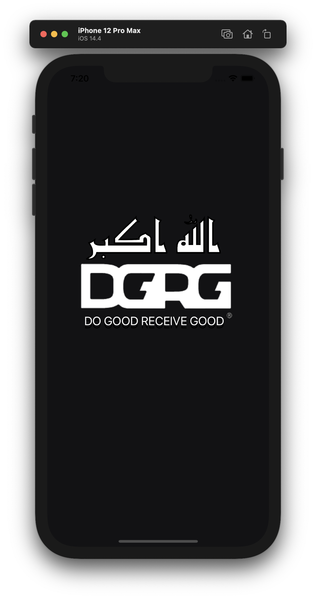
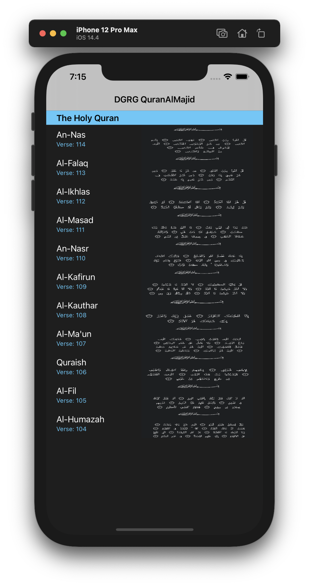
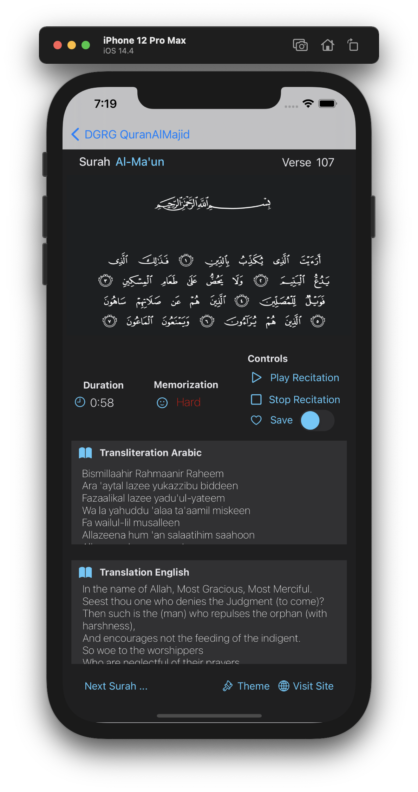

# QURAN AL MAJID 

Application to better help children and individuals of other learning demographics learn the Holy Quran verses. 

<p float="left">
  
   
  
</p>

## Description

The QuranALMajid Application allows individuals to browse the most powerful verses or surahs of the Holy Quran, allowing them to indulge themselves in the beautiful recitation of the Quran. Furthermore, the application allows for information such as transliteration in Arabic and the translation of verses in English to be read. In addition, the application offers much control, having a play recitation function—the ability to stop and save the recitation if the user would like to return to it. A memorization rating is also provided to help facilitate the learning process for children or adults. Moreover, the duration of the recitation recording is also shown in the application's interface, along with the name of the verse and its corresponding number. The application offers a visit site button for additional information, which allows more information to be researched on the quranic verse itself. A customizable interface is also made available, having a plethora of theme colour options. 

## Getting Started

### Dependencies

* Latest version of XCode installed.
* Tested on MacOS Big Sur, iPhone 12 Pro Max Simulator.

### Installing
* Clone the repository using the command below.
```
git clone https://github.com/cfahd/quranalmajid.git
```

### Executing program

* Open the file enitiled *"FahdsApp-P1.xcodeproj"*, and XCode will open the project.
* Click the iPhone 12 Pro Max Simulator, and click the play icon to load the application.


## Authors

Contributors names and contact info

Developer: [@cFahd](https://github.com/cfahd/)

## Version History

* 0.1
    * Various bug fixes and optimizations
    * See [commit change]() or See [release history]()
    * Initial Release

## License

This project is licensed under cFahd - see the LICENSE file for details

